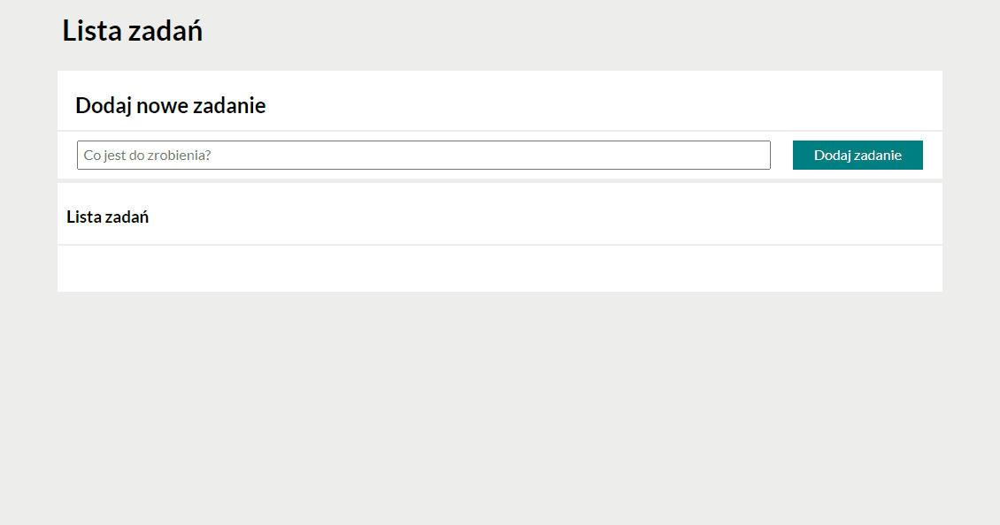

# # Przemyław Nielepkowicz - To Do List 4 project

## Demo 

https://przemyslaw-nielepkowicz.github.io/homepage_todo/

### The website is created while learning the basics of programming.
### Used Technologies:
- HTML
- CSS
- JavaScript
- BEM

(Took me longer than it should have, but somehow it works.)

